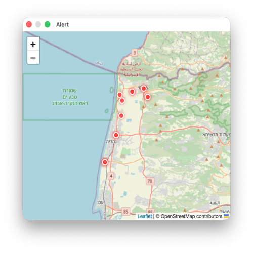

# OREF Alert Tool

A Python-based alert monitoring system that polls the Israeli OREF (emergency readiness) alert API, deduplicates alerts, logs them, and displays active alerts on an interactive macOS map popup.

## Features

- **Real-time Alert Polling**: Continuously monitors the OREF alert API for new emergency alerts
- **Smart Deduplication**: Automatically eliminates duplicate alert entries
- **Dual Logging**: Maintains both human-readable and raw JSON logs for easy auditing
- **Local Notifications**: Emits an audible beep when your location is affected by an alert
- **Visual Map Display**: Shows alert locations on an interactive Leaflet-based map in a floating macOS popup
- **Automatic Cleanup**: Popup auto-closes after 60 seconds of inactivity
- **Persistent Storage**: Maintains an IPC JSON file for alert history and inter-process communication

## Popup Preview



The popup displays:
- Interactive Leaflet map centered on alert locations
- Red markers indicating active alerts
- City/region information overlaid on the map
- Automatic scrolling updates as new alerts arrive

## Project Structure

```
alert/
├── alert.py                 # Main polling loop and entry point
├── map_popup.py            # macOS appearance API and WebKit popup management
├── map.html                # Leaflet map template
├── cities.json             # City location database
├── design-doc.md           # Refactoring design document
├── test_alert_e2e.py       # End-to-end test suite
├── _alert/                 # Main package
│   ├── __init__.py
│   ├── alert_model.py      # Alert data model
│   ├── beep.py             # Audio notification via osascript
│   ├── cities.py           # City lookup and management
│   ├── config.py           # Centralized configuration
│   ├── dedup.py            # Alert deduplication logic
│   ├── fetcher.py          # OREF API client
│   ├── html_builder.py     # Map HTML generation
│   ├── ipc.py              # Inter-process communication
│   ├── lock.py             # File locking utilities
│   ├── log_formatted.py    # Human-readable logging
│   ├── log_raw.py          # Raw JSON logging
│   ├── popup.py            # Popup window management
│   └── popup_launcher.py   # Process lifecycle

```

## Installation

### Requirements
- Python 3.9+
- macOS 10.13+
- Network access to OREF API

### Setup

```bash
# Clone or download the project
cd alert

# Create a virtual environment
python3 -m venv .venv
source .venv/bin/activate

# Install dependencies (if any)
pip install -r requirements.txt  # if present

# Set your location
export MY_LOCATION="Tel Aviv"
```

## Configuration

Configuration is centralized in `_alert/config.py` and can be overridden via environment variables:

```bash
# API Configuration
export OREF_API_URL="https://api.oref.org.il/..."
export POLL_INTERVAL="30"  # seconds

# Notifications
export MY_LOCATION="Your City Name"

# Popup Behavior
export AUTO_CLOSE_SECONDS="60"

# Logging
export FORMATTED_LOG_PATH="~/.alert_formatted.log"
export RAW_LOG_PATH="~/.alert_raw.log"
export ALERTS_IPC_FILE="~/.alert_ipc.json"
```

## Usage

### Start the Alert Monitor

```bash
python alert.py
```

The tool will:
1. Start polling the OREF API at regular intervals
2. Display a floating map popup for each new alert affecting your location
3. Log all alerts to both formatted and raw log files
4. Beep when an alert is detected for your city

### View Logs

```bash
# Human-readable formatted log
tail -f ~/.alert_formatted.log

# Raw JSON log
tail -f ~/.alert_raw.log
```

### Check Latest Alerts (IPC)

```bash
cat ~/.alert_ipc.json | jq '.'
```

## Log Format

### Formatted Log

```
[2026-03-20 14:30:45] ID: 12345 | Title: זהירות | Zone: תל אביב | Areas: אזור מרכז | ETA: 10 דקות
```

### Raw JSON Log

```json
{"timestamp": "2026-03-20T14:30:45Z", "id": 12345, "title": "זהירות", "zone": "תל אביב", "areas": ["אזור מרכז"], "estimated_time": "10 דקות"}
```

## Architecture

The project follows a modular, testable architecture with clear separation of concerns:

- **Config Management** (`config.py`): Centralized configuration with environment variable overrides
- **Data Models** (`alert_model.py`): Type-safe alert representation
- **API Integration** (`fetcher.py`): Handles HTTP requests and response parsing
- **Deduplication** (`dedup.py`): Stateful deduplication logic
- **Logging** (`log_formatted.py`, `log_raw.py`): Dual-format persistence
- **Notifications** (`beep.py`): Audio alerts via osascript
- **IPC** (`ipc.py`, `lock.py`): Inter-process communication with file locking
- **UI** (`popup_launcher.py`, `popup.py`): macOS WebKit popup management
- **HTML** (`html_builder.py`): Leaflet map template rendering
- **Cities** (`cities.py`): Location database with lookup utilities

See [design-doc.md](design-doc.md) for detailed architectural rationale.

## Testing

Run the end-to-end test suite:

```bash
python test_alert_e2e.py -v
```

Tests verify:
- API polling and parsing
- Deduplication logic
- Logging output format
- File locking mechanisms
- City database loading
- IPC communication
- HTML template rendering

## Troubleshooting

### Popup not appearing
- Check that the popup process is running: `ps aux | grep popup`
- Verify file permissions on `~/.alert_ipc*.json`
- Check system logs: `log show --predicate 'process == "alert"'`

### No beep on alerts
- Ensure `osascript` is available: `which osascript`
- Verify `MY_LOCATION` environment variable is set correctly
- Check that the alert's affected areas match your location

### Missing alerts
- Verify network connectivity: `curl https://api.oref.org.il/...`
- Check formatted and raw logs for parsing errors
- Review `_alert/fetcher.py` for API schema changes

## Dependencies

- **Leaflet.js**: Map rendering library (bundled in `map.html`)
- **OpenStreetMap**: Map tile provider (attribution included)
- **Standard Library**: No external Python dependencies required

## License

This project is provided as-is for personal use. Ensure compliance with OREF API terms of service.

## References

- [OREF Official Website](https://www.oref.org.il/)
- [Leaflet.js Documentation](https://leafletjs.com/)
- [Python typing](https://docs.python.org/3/library/typing.html)

---

For architecture details and refactoring rationale, see [design-doc.md](design-doc.md).
