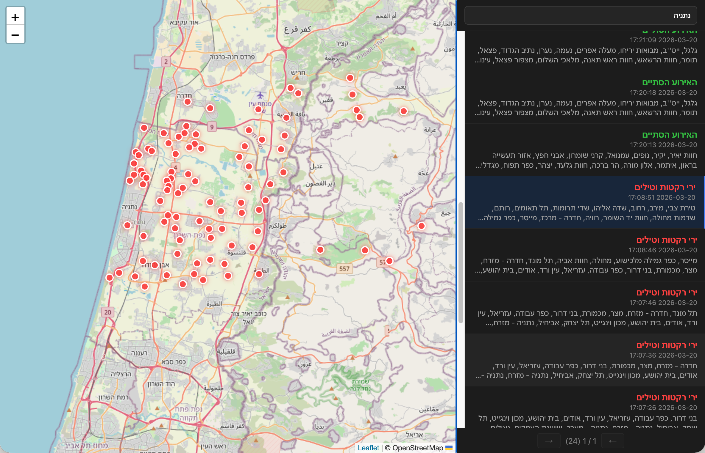

# OREF Alert Tool

A Python-based alert monitoring system that polls the Israeli OREF (emergency readiness) alert API, deduplicates alerts, logs them, and displays active alerts on an interactive macOS map popup.

## Table of Contents

- [Features](#features)
- [Popup Preview](#popup-preview)
- [Alert History](#alert-history)
- [Project Structure](#project-structure)
- [Installation](#installation)
- [Configuration](#configuration)
- [Usage](#usage)
- [Log Format](#log-format)
- [Architecture](#architecture)
- [Testing](#testing)
- [Troubleshooting](#troubleshooting)
- [Dependencies](#dependencies)
- [License](#license)
- [References](#references)

## Features

- **Real-time Alert Polling**: Continuously monitors the OREF alert API for new emergency alerts (default: every 2 seconds)
- **Smart Deduplication**: Automatically eliminates duplicate alert entries
- **Raw JSON Logging**: Appends every alert as a timestamped JSON line to `alerts_raw.txt`
- **Local Notifications**: Emits an audible beep when your location is affected by an alert
- **Visual Map Display**: Shows **all** alert locations on an interactive Leaflet-based map in a floating macOS popup
- **Alert History Page**: Browse past alerts with an interactive map, category/date filters, and pagination (`history.html`)
- **Automatic Cleanup**: Popup auto-closes after 60 seconds of inactivity
- **IPC**: A shared JSON file (`/tmp/oref_alerts.json`) allows the poller and popup to communicate; a lock file prevents duplicate popup processes

## Popup Preview


The popup displays:
- Interactive Leaflet map centered on alert locations
- Red markers indicating active alerts
- City/region information overlaid on the map
- Automatic scrolling updates as new alerts arrive

## Alert History



Paginated alert history view with an interactive map and category/date filters.

## Project Structure

```
alert/
├── alert.py                 # Main polling loop and entry point
├── map_popup.py             # macOS WebKit popup management
├── map.html                 # Leaflet map template (popup)
├── history.html             # Alert history page with filters and pagination
├── cities.json              # City location database
├── alerts_raw.txt           # Raw alert log (sample data included)
├── oref-ctl.sh              # Start/stop/status script (macOS Launch Agent)
├── docs/                    # Project documentation
│   ├── prd.md               # Product requirements document
│   └── design-doc.md        # Refactoring design document
├── test_alert_e2e.py        # End-to-end test suite
├── _alert/                  # Main package
│   ├── __init__.py
│   ├── alert_model.py       # Alert data model
│   ├── beep.py              # Audio notification via osascript
│   ├── cities.py            # City lookup and management
│   ├── config.py            # Centralized configuration
│   ├── dedup.py             # Alert deduplication logic
│   ├── fetcher.py           # OREF API client
│   ├── html_builder.py      # Map HTML generation
│   ├── ipc.py               # Inter-process communication
│   ├── lock.py              # File locking utilities
│   ├── log_raw.py           # Raw JSON logging
│   ├── popup.py             # Popup window management
│   └── popup_launcher.py    # Process lifecycle

```

## Installation

### Requirements
- Python 3.9+
- macOS 10.13+
- Network access to OREF API

### Setup (pip)

```bash
cd alert

python3 -m venv .venv
source .venv/bin/activate

pip install -r requirements.txt

# Set your location (default: חיפה)
export OREF_MY_LOCATION="חיפה"
```

### Setup (Poetry)

```bash
cd alert

poetry install

# Set your location (default: חיפה)
export OREF_MY_LOCATION="חיפה"
```

## Configuration

Configuration is centralized in `_alert/config.py` and can be overridden via environment variables:

```bash
# API
export OREF_API_URL="https://www.oref.org.il/WarningMessages/Alert/alerts.json"
export OREF_POLL_INTERVAL="2"        # seconds

# Notifications
export OREF_MY_LOCATION="חיפה"       # beep when this city appears in an alert

# Popup
export OREF_AUTO_CLOSE_SECONDS="60"

# Logging & IPC
export OREF_RAW_LOG="alerts_raw.txt"           # raw JSON log path
export OREF_ALERTS_IPC="/tmp/oref_alerts.json"  # IPC file for popup communication
export OREF_POPUP_LOCK="/tmp/oref_popup.lock"   # lock to prevent duplicate popups
```

## Usage

### Background Service (recommended)

Use `oref-ctl.sh` to run the monitor as a macOS Launch Agent. It survives terminal close and auto-restarts on crash.

```bash
./oref-ctl.sh start     # install and start
./oref-ctl.sh stop      # stop and uninstall
./oref-ctl.sh restart   # stop + start
./oref-ctl.sh status    # check if running
./oref-ctl.sh log       # tail the service log
```

### Foreground

```bash
python alert.py
```

The tool will:
1. Start polling the OREF API every 2 seconds
2. Display a floating map popup for every new alert
3. Log all alerts to `alerts_raw.txt`
4. Beep when an alert is detected for your configured location

### View Raw Log

```bash
tail -f alerts_raw.txt
```

### IPC

The poller and popup process communicate through a shared JSON file at `/tmp/oref_alerts.json`:

- The poller appends each new alert to this file via `_alert/ipc.py`.
- The popup process polls this file every second to pick up new alerts and update the map.
- A lock file (`/tmp/oref_popup.lock`) ensures only one popup process runs at a time.

The IPC file is created on the first alert and cleared when the popup closes. You can inspect it manually:

```bash
cat /tmp/oref_alerts.json | jq '.'
```

### Alert Data Sample

`alerts_raw.txt` contains example alert data captured from the OREF API. Each line is a timestamped JSON entry:

```
[2026-03-20 02:48:40] {"id": "134184413140000000", "cat": "1", "title": "ירי רקטות וטילים", "data": ["חיפה - כרמל, הדר ועיר תחתית", ...], "desc": "היכנסו למרחב המוגן"}
```

## Log Format

Each line in `alerts_raw.txt` follows this format:

```
[YYYY-MM-DD HH:MM:SS] {JSON alert object}
```

The JSON alert object mirrors the OREF API response with fields: `id`, `cat`, `title`, `data` (list of affected cities), and `desc`.

## Architecture

The project follows a modular, testable architecture with clear separation of concerns:

- **Config Management** (`config.py`): Centralized configuration with environment variable overrides
- **Data Models** (`alert_model.py`): Type-safe alert representation
- **API Integration** (`fetcher.py`): Handles HTTP requests and response parsing
- **Deduplication** (`dedup.py`): Stateful deduplication logic
- **Logging** (`log_raw.py`): Timestamped JSON-per-line log persistence
- **Notifications** (`beep.py`): Audio alerts via osascript
- **IPC** (`ipc.py`, `lock.py`): Shared JSON file for poller-popup communication, with file locking
- **UI** (`popup_launcher.py`, `popup.py`): macOS WebKit popup management
- **HTML** (`html_builder.py`, `map.html`, `history.html`): Leaflet map rendering
- **Cities** (`cities.py`): Location database with lookup utilities

See [docs/design-doc.md](docs/design-doc.md) for detailed architectural rationale.

## Testing

Run the end-to-end test suite:

```bash
# With pip / venv
pytest test_alert_e2e.py -v

# With Poetry
poetry run pytest test_alert_e2e.py -v
```

Tests verify:
- API polling and parsing
- Deduplication logic
- Logging output format
- File locking mechanisms
- City database loading
- IPC communication
- HTML template rendering

## Troubleshooting

### Popup not appearing
- Check that the popup process is running: `ps aux | grep popup`
- Verify file permissions on `/tmp/oref_alerts.json` and `/tmp/oref_popup.lock`

### No beep on alerts
- Ensure `osascript` is available: `which osascript`
- Verify `OREF_MY_LOCATION` environment variable matches a city name in `cities.json`

### Missing alerts
- Verify network connectivity to the OREF API
- Check `alerts_raw.txt` for recent entries
- Review `_alert/fetcher.py` for API schema changes

## Dependencies

- **Leaflet.js**: Map rendering library (bundled in `map.html`)
- **OpenStreetMap**: Map tile provider (attribution included)
- **pyobjc-framework-Cocoa / WebKit**: macOS native UI (installed via `requirements.txt` or Poetry)
- **pytest**: Test runner (dev dependency)

## License

This project is provided as-is for personal use. Ensure compliance with OREF API terms of service.

## References

- [OREF Official Website](https://www.oref.org.il/)
- [Leaflet.js Documentation](https://leafletjs.com/)
- [Python typing](https://docs.python.org/3/library/typing.html)

---

For product requirements, see [docs/prd.md](docs/prd.md). For architecture details, see [docs/design-doc.md](docs/design-doc.md).
