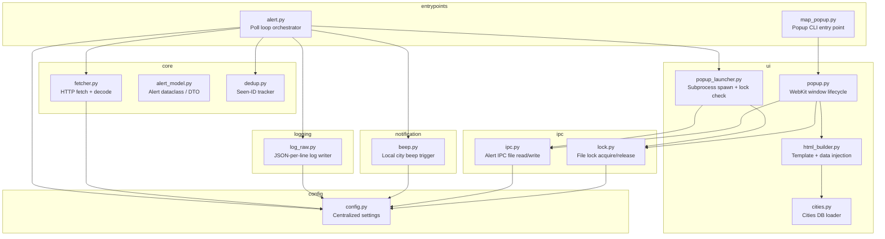

# OREF Alert Tool -- Refactoring Design Document

## Overview

The OREF alert tool polls a government alert API, deduplicates alerts, logs them in two formats (human-readable and raw JSON), triggers a local beep when the user's city is affected, and displays alerts on a floating macOS map popup via WebKit.

The current implementation lives in two files (`alert.py` ~98 LOC, `map_popup.py` ~253 LOC) plus an HTML template. It works, but concentrates many responsibilities per file, uses module-level mutable state, hardcodes configuration, and makes testing possible only through subprocess invocation (the e2e tests all shell out because the modules are not injectable).

## Requirements

### Functional (preserved -- e2e tests must pass)
- Poll OREF API, decode utf-8-sig responses
- Deduplicate alerts by ID
- Write formatted log entries (timestamp, id, title, zone, areas, estimated time)
- Write raw JSON log entries (timestamp + JSON per line)
- Beep via `osascript` when `MY_LOCATION` appears in alert data
- Append alert to IPC JSON file
- Launch/reuse a floating WebKit popup that auto-closes after 60s of inactivity
- Build HTML by injecting alert/city data into a Leaflet template
- CLI: `map_popup.py` with no args prints usage and exits 1

### Non-Functional (targets of refactoring)
- Modules importable and testable in-process (no subprocess needed for unit tests)
- Clear separation of concerns (one module, one job)
- Configuration centralized and overridable
- No module-level mutable global state
- Explicit dependency injection where practical
- Minimal public surface per module

## Current State Analysis

### Problem 1: God modules with mixed concerns

| File | Responsibilities |
|---|---|
| `alert.py` | HTTP fetching, JSON parsing, BOM stripping, formatted logging, raw logging, beep notification, deduplication state, poll loop, file creation |
| `map_popup.py` | IPC file management, file locking, process lifecycle, cities DB loading/caching, HTML template rendering, macOS AppKit/WebKit window management, signal handling, CLI entry point |

Both files violate SRP heavily.

### Problem 2: Module-level mutable state

- `alert.py` uses `seen_ids: set[str]` at module scope -- makes deduplication untestable without subprocess isolation.
- `map_popup.py` uses `_cities_db: list[dict] | None` as a lazy-load cache at module scope.

### Problem 3: Hardcoded configuration scattered across files

- `URL`, `POLL_INTERVAL`, `HEADERS` in `alert.py`
- `MY_LOCATION`, `AUTO_CLOSE_SECONDS`, `ALERTS_IPC`, `POPUP_LOCK_FILE`, file paths in `map_popup.py`
- Log file paths derived from `__file__` at import time

### Problem 4: No dependency injection

- `beep_if_local` directly calls `subprocess.Popen`
- `fetch_alert` directly uses `urllib`
- `send_to_popup` directly spawns a subprocess
- Functions cannot be unit-tested without monkey-patching

### Problem 5: Duplicated cleanup logic

`_run_popup` has two identical lock-release + file-cleanup blocks (in `do_close` and `handle_term`).

### Problem 6: Tight coupling between alert.py and map_popup.py

`alert.py` imports `send_to_popup` and `MY_LOCATION` directly from `map_popup.py`, creating a bidirectional knowledge dependency between the poller and the UI.

## Target Architecture

### Module Diagram



### Package Layout

```
alert/
    __init__.py
    config.py              # All settings: paths, URLs, intervals, location
    alert_model.py         # Alert dataclass (typed DTO)
    fetcher.py             # fetch_alert() -- HTTP + BOM decode
    dedup.py               # AlertDeduplicator class (encapsulates seen_ids)
    log_raw.py             # write_raw_entry()
    beep.py                # beep_if_local()
    ipc.py                 # append_alert(), read_alerts()
    lock.py                # try_acquire_lock(), LockContext
    html_builder.py        # build_html(alerts, cities)
    cities.py              # load_cities(path) -> list[dict]
    popup.py               # run_popup() -- AppKit/WebKit (standalone process)
    popup_launcher.py      # send_to_popup() -- spawn/reuse popup process
    alert.py               # main() poll loop -- thin orchestrator
    map_popup.py           # CLI entry for popup (preserves current CLI contract)
    map.html               # Leaflet template (unchanged)
    cities.json            # City database (unchanged)
test_alert_e2e.py          # Existing e2e tests (unchanged, still import top-level alert and map_popup)
```

### Backward Compatibility Layer

The e2e tests import `alert` and `map_popup` as top-level modules and access attributes like `a.RAW_LOG`, `mp._append_alert`, `mp._build_html`, `mp.ALERTS_IPC`. The refactored entry-point files (`alert.py`, `map_popup.py`) must re-export all symbols the tests reference:

| Test accesses | Must remain at |
|---|---|
| `alert.URL` | `alert.URL` (delegating to `config`) |
| `alert.RAW_LOG` | `alert.RAW_LOG` |
| `alert.log_raw(dict)` | `alert.log_raw` |
| `alert.fetch_alert()` | `alert.fetch_alert` |
| `alert.ensure_log_files()` | `alert.ensure_log_files` |
| `alert.seen_ids` | `alert.seen_ids` |
| `alert.beep_if_local(dict)` | `alert.beep_if_local` |
| `map_popup._append_alert(dict)` | `map_popup._append_alert` |
| `map_popup._build_html(list)` | `map_popup._build_html` |
| `map_popup.ALERTS_IPC` | `map_popup.ALERTS_IPC` |
| `map_popup.send_to_popup(dict)` | `map_popup.send_to_popup` |
| `map_popup.MY_LOCATION` | `map_popup.MY_LOCATION` (used by `alert.beep_if_local`) |

The facade files will import from internal modules and re-export these names. Tests will not need modification.

## Contracts and Interfaces

### config.py

```python
@dataclass
class Config:
    api_url: str
    poll_interval: int          # seconds
    http_headers: dict[str, str]
    raw_log_path: str
    my_location: str
    auto_close_seconds: int
    alerts_ipc_path: str
    popup_lock_path: str
    cities_json_path: str
    map_template_path: str
    venv_python_path: str

def default_config() -> Config: ...
```

### alert_model.py

```python
@dataclass(frozen=True)
class Alert:
    id: str
    cat: str
    title: str
    data: list[str]             # city names
    desc: str
    zone: str
    original_countdown: int

    @classmethod
    def from_dict(cls, d: dict) -> "Alert": ...
    def to_dict(self) -> dict: ...
```

### fetcher.py

```python
def fetch_alert(url: str, headers: dict[str, str], timeout: int = 5) -> dict | None:
    """Fetch and decode a single alert from the API. Returns None on error or empty body."""
```

### dedup.py

```python
class AlertDeduplicator:
    """Tracks seen alert IDs. Thread-safe is not required (single-threaded poll loop)."""
    def __init__(self) -> None: ...
    def is_new(self, alert_id: str) -> bool: ...
    def mark_seen(self, alert_id: str) -> None: ...
    @property
    def seen_ids(self) -> set[str]: ...
```

### log_raw.py

```python
def write_raw_entry(alert: dict, log_path: str) -> None:
    """Append one timestamped JSON line."""
```

### beep.py

```python
def beep_if_local(alert: dict, my_location: str) -> None:
    """Trigger macOS beep if my_location appears in alert['data']."""
```

### ipc.py

```python
def append_alert(alert: dict, ipc_path: str) -> None:
    """Read existing alerts from IPC file, append new one, write back. Recovers from corrupt files."""

def read_alerts(ipc_path: str) -> list[dict]:
    """Read alerts from IPC file. Returns [] on missing/corrupt file."""
```

### lock.py

```python
def try_acquire_lock(lock_path: str) -> bool:
    """Non-blocking lock check. Returns True if no other process holds the lock."""

@contextmanager
def hold_lock(lock_path: str) -> Generator[int, None, None]:
    """Context manager that holds an exclusive flock for its lifetime. Yields the fd."""
```

### html_builder.py

```python
def build_html(alerts: list[dict], cities_db: list[dict], template_path: str) -> str:
    """Inject alert JSON and cities JSON into the HTML template."""
```

### cities.py

```python
def load_cities(path: str) -> list[dict]:
    """Load and return the cities database. Returns [] if file missing."""
```

### popup_launcher.py

```python
def send_to_popup(alert: dict, config: Config) -> None:
    """Append alert to IPC and launch popup subprocess if not already running."""
```

## Design Patterns Used

| Pattern | Where | Why |
|---|---|---|
| **Facade** | `alert.py`, `map_popup.py` (top-level) | Preserve backward-compatible public API for e2e tests while delegating to internal modules |
| **Data Transfer Object** | `alert_model.Alert` | Typed, immutable representation of an alert; decouples parsing from processing |
| **Strategy (implicit)** | `beep_if_local` takes `my_location` as param | Makes notification behavior configurable without changing call sites |
| **Context Manager** | `lock.hold_lock` | Ensures lock release even on exceptions; eliminates duplicated cleanup in popup |
| **Configuration Object** | `config.Config` | Single source of truth for all settings; eliminates scattered constants |

## Implementation Plan

Each step is a standalone commit. Run `pytest test_alert_e2e.py` after every step to confirm green.

### Step 1: Create `config.py`
Extract all constants (`URL`, `POLL_INTERVAL`, `HEADERS`, `MY_LOCATION`, `AUTO_CLOSE_SECONDS`, path derivations) into a `Config` dataclass with a `default_config()` factory. Keep originals in `alert.py` / `map_popup.py` as aliases reading from config.

### Step 2: Create `alert_model.py`
Define the `Alert` dataclass with `from_dict` / `to_dict`. No callers changed yet -- this is additive.

### Step 3: Extract `fetcher.py`
Move `fetch_alert` logic into `fetcher.py`. The function receives `url` and `headers` as parameters. In `alert.py`, replace the body of `fetch_alert()` with a delegation call. Tests still import `alert.fetch_alert` -- it still works.

### Step 4: Extract `log_raw.py`
Move raw logging function. It receives the log path as a parameter. The `alert.py` wrapper delegates, passing `RAW_LOG`.

### Step 5: Extract `beep.py`
Move `beep_if_local`. It now takes `my_location` as a parameter. The `alert.py` wrapper passes `MY_LOCATION`.

### Step 6: Extract `dedup.py`
Create `AlertDeduplicator` class. In `alert.py`, instantiate one and expose `seen_ids` as a module-level attribute backed by the deduplicator's internal set.

### Step 7: Extract `ipc.py` and `lock.py`
Move `_append_alert`, IPC read logic, and lock logic. `map_popup.py` wrappers delegate to these. The `hold_lock` context manager replaces the duplicated cleanup blocks in `_run_popup`.

### Step 8: Extract `cities.py` and `html_builder.py`
Move `_get_cities_db` into `cities.py` as `load_cities`. Move `_build_html` into `html_builder.py`. `map_popup._build_html` delegates.

### Step 9: Extract `popup_launcher.py`
Move `send_to_popup` logic (minus the popup window itself). `map_popup.send_to_popup` delegates.

### Step 10: Refactor `popup.py`
Move `_run_popup` into `popup.py`, refactored to use `hold_lock` context manager and `ipc.read_alerts`. This eliminates the duplicated cleanup. `map_popup.py` CLI still calls it.

### Step 11: Clean up facade files
`alert.py` and `map_popup.py` become thin facades: imports + re-exports + the `main()` / CLI entry points. Verify all 26 e2e tests pass.

## Open Questions

1. **Python package vs flat files** -- Should the internal modules live in an `alert/` package directory, or remain as flat files alongside the entry points? A package is cleaner but changes the import path. The facade approach works either way; flat files are simpler for this project's scale.

2. **Config override mechanism** -- Should `Config` support env vars or a YAML/TOML file, or is the dataclass + `default_config()` sufficient? Current tests override config by assigning to module attributes (`a.RAW_LOG = ...`). This must keep working.

3. **Typed Alert everywhere** -- The e2e tests pass plain dicts. Introducing the `Alert` dataclass internally is clean, but forcing it at the public API boundary would break tests. Recommendation: use dicts at the facade boundary, `Alert` internally only. Conversion happens inside the facade.

---

**Status: Awaiting approval before implementation begins.**
